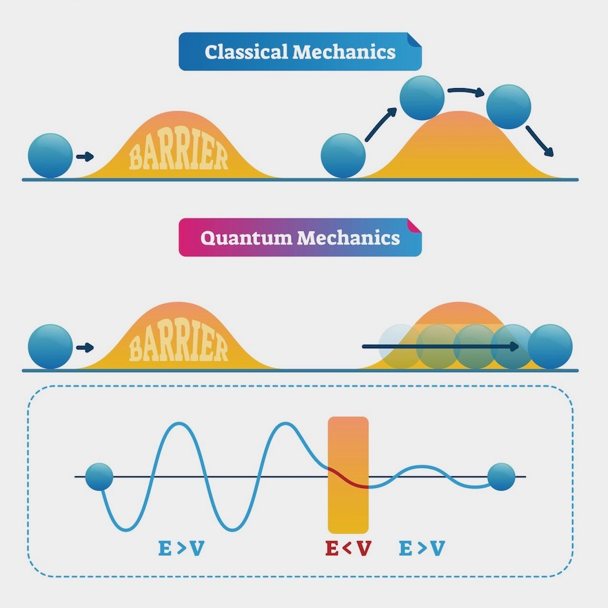
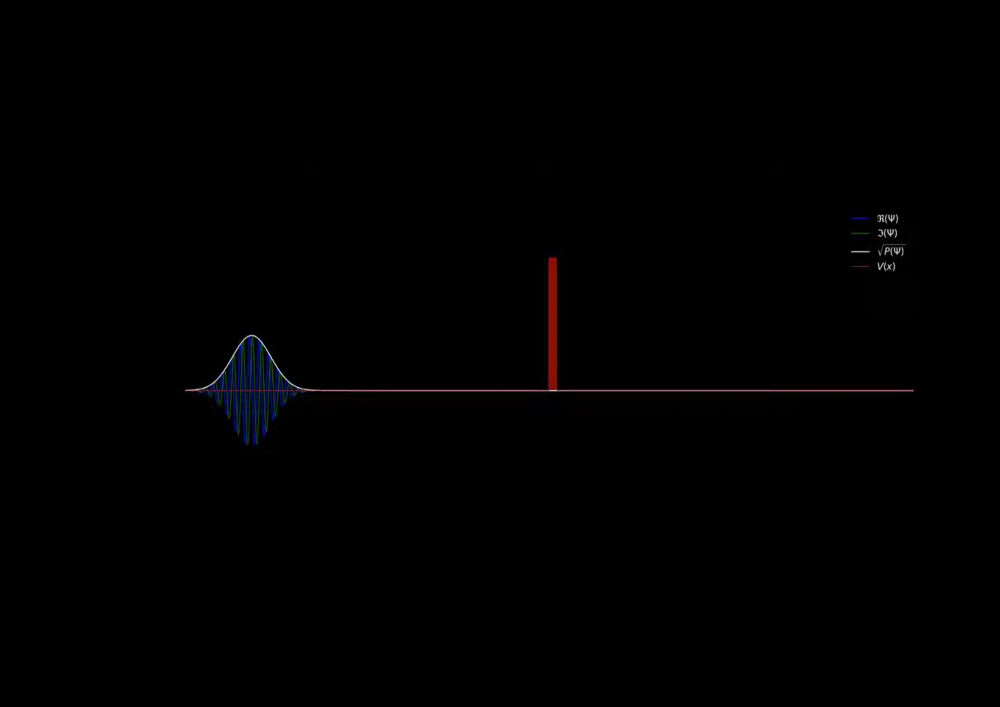

<!-- Improved compatibility of back to top link: See: https://github.com/othneildrew/Best-README-Template/pull/73 -->

<!--
*** Thanks for checking out the Best-README-Template. If you have a suggestion
*** that would make this better, please fork the repo and create a pull request
*** or simply open an issue with the tag "enhancement".
*** Don't forget to give the project a star!
*** Thanks again! Now go create something AMAZING! :D
-->

<!-- PROJECT SHIELDS -->
<!--
*** I'm using markdown "reference style" links for readability.
*** Reference links are enclosed in brackets [ ] instead of parentheses ( ).
*** See the bottom of this document for the declaration of the reference variables
*** for contributors-url, forks-url, etc. This is an optional, concise syntax you may use.
*** https://www.markdownguide.org/basic-syntax/#reference-style-links
-->

[![LinkedIn][linkedin-shield]][linkedin-url] 

<!-- PROJECT LOGO -->
 

  

<h3 align="center">Quantum Tunneling</h3>

  

    Animating the 1D Time-Dependent Schrodinger Equation
     
    <a href="https://github.com/DannyBozbay/Quantum-Tunneling"><strong>Explore the docs »</strong></a>
     
     
    <a href="https://github.com/DannyBozbay/Quantum-Tunneling">View Demo</a>
    ·
    <a href="https://github.com/DannyBozbay/Quantum-Tunneling/issues">Report Bug</a>
    ·
    <a href="https://github.com/DannyBozbay/Quantum-Tunneling/issues">Request Feature</a>
  

<!-- ABOUT THE PROJECT -->
## About The Project

In this project, we use numerial method in Python to solve the 1D Time-Dependent Schrodinger Equation for the Quantum Tunnelling problem: *a particle approaching a potential barrier*. 

Our quantum particle is modelled using a Gaussian wavepacket, and our potential barrier is given by a step function. 

We use plot and animate the time-evolution of the quantum system using Matplotlib, allowing us to visualise the tunnelling effect of the particle which is impossible in the classical realm!

(<a href="#readme-top">back to top</a>)

<!-- ANIMATION -->
## Animation

(<a href="#readme-top">back to top</a>)

<!-- LICENSE -->
## License

Distributed under the MIT License. See `LICENSE.txt` for more information.

(<a href="#readme-top">back to top</a>)

<!-- CONTACT -->
## Contact

Youtube - https://www.youtube.com/@dannybozbay

Instagram - [@DannyBozbay](https://twitter.com/DannyBozbay) 

Email - dannybozbay@gmail.com

Project Link: [https://github.com/DannyBozbay/Quantum-Tunneling](https://github.com/DannyBozbay/Quantum-Tunneling)

(<a href="#readme-top">back to top</a>)

<!-- ACKNOWLEDGMENTS -->
## Acknowledgments

* 

(<a href="#readme-top">back to top</a>)

<!-- MARKDOWN LINKS & IMAGES -->
<!-- https://www.markdownguide.org/basic-syntax/#reference-style-links -->
[contributors-shield]: https://img.shields.io/github/contributors/DannyBozbay/Quantum-Tunneling.svg?style=for-the-badge
[contributors-url]: https://github.com/DannyBozbay/Quantum-Tunneling/graphs/contributors
[forks-shield]: https://img.shields.io/github/forks/DannyBozbay/Quantum-Tunneling.svg?style=for-the-badge
[forks-url]: https://github.com/DannyBozbay/Quantum-Tunneling/network/members
[stars-shield]: https://img.shields.io/github/stars/DannyBozbay/Quantum-Tunneling.svg?style=for-the-badge
[stars-url]: https://github.com/DannyBozbay/Quantum-Tunneling/stargazers
[issues-shield]: https://img.shields.io/github/issues/DannyBozbay/Quantum-Tunneling.svg?style=for-the-badge
[issues-url]: https://github.com/DannyBozbay/Quantum-Tunneling/issues
[license-shield]: https://img.shields.io/github/license/DannyBozbay/Quantum-Tunneling.svg?style=for-the-badge
[license-url]: https://github.com/DannyBozbay/Quantum-Tunneling/blob/master/LICENSE.txt
[linkedin-shield]: https://img.shields.io/badge/-LinkedIn-black.svg?style=for-the-badge&logo=linkedin&colorB=555
[linkedin-url]: https://linkedin.com/in/DannyBozbay
[product-screenshot]: images/screenshot.png
[Next.js]: https://img.shields.io/badge/next.js-000000?style=for-the-badge&logo=nextdotjs&logoColor=white
[Next-url]: https://nextjs.org/
[React.js]: https://img.shields.io/badge/React-20232A?style=for-the-badge&logo=react&logoColor=61DAFB
[React-url]: https://reactjs.org/
[Vue.js]: https://img.shields.io/badge/Vue.js-35495E?style=for-the-badge&logo=vuedotjs&logoColor=4FC08D
[Vue-url]: https://vuejs.org/
[Angular.io]: https://img.shields.io/badge/Angular-DD0031?style=for-the-badge&logo=angular&logoColor=white
[Angular-url]: https://angular.io/
[Svelte.dev]: https://img.shields.io/badge/Svelte-4A4A55?style=for-the-badge&logo=svelte&logoColor=FF3E00
[Svelte-url]: https://svelte.dev/
[Laravel.com]: https://img.shields.io/badge/Laravel-FF2D20?style=for-the-badge&logo=laravel&logoColor=white
[Laravel-url]: https://laravel.com
[Bootstrap.com]: https://img.shields.io/badge/Bootstrap-563D7C?style=for-the-badge&logo=bootstrap&logoColor=white
[Bootstrap-url]: https://getbootstrap.com
[JQuery.com]: https://img.shields.io/badge/jQuery-0769AD?style=for-the-badge&logo=jquery&logoColor=white
[JQuery-url]: https://jquery.com 
